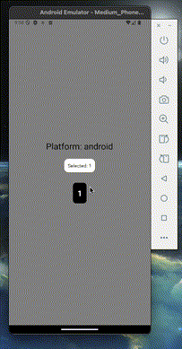

# React Native Custom Picker

A customizable picker for React Native that adapts to both iOS and Android. This picker is designed to fit into tight spaces, making it ideal for layouts where multiple pickers or other components need to coexist efficiently.

## Features

- **iOS:** Uses `@react-native-picker/picker` (this dependency will automatically install when this package is installed).
- **Android:** Uses `ScrollView` for a native-like scrolling experience.
- **Customizable**: Allows setting width, font size, background color, and other styles.
- **Compact Design**: Fits well in small spaces while maintaining usability.
- **Bold Selection Option**: Control whether the selected item appears in bold.

## Demos

### iOS


### Android



## Installation

1. Clone this repo to your machine:

   ```sh
   git clone https://github.com/costa-rica/react-native-custom-picker.git
   ```

2. Install the package in your project:
   ```sh
   yarn add file:/path/to/react-native-custom-picker
   ```
   or
   ```sh
   npm install /path/to/react-native-custom-picker
   ```

## Usage

```js
import CustomPicker from "react-native-custom-picker";
import { useState } from "react";

const [selectedItem, setSelectedItem] = useState("Apple");

<CustomPicker
  arrayElements={["Apple", "Banana", "Orange"]}
  value={selectedItem}
  onChange={setSelectedItem}
  style={{
    width: 120,
    itemHeight: 40,
    fontSize: 16,
    backgroundColor: "black",
    color: "white",
  }}
  selectedIsBold={true}
/>;
```

## Props

| Prop Name        | Type       | Required | Default | Description                                                                   |
| ---------------- | ---------- | -------- | ------- | ----------------------------------------------------------------------------- |
| `arrayElements`  | `array`    | ✅ Yes   | -       | Array of selectable items. Must not be empty.                                 |
| `value`          | `any`      | ✅ Yes   | -       | The currently selected value. Must be one of the elements in `arrayElements`. |
| `onChange`       | `function` | ✅ Yes   | -       | Function that handles selection changes.                                      |
| `style`          | `object`   | ❌ No    | `{}`    | Custom styles for the picker. See available properties below.                 |
| `selectedIsBold` | `boolean`  | ❌ No    | `true`  | Determines if the selected item should be bold.                               |

### Style Properties

The `style` prop accepts an object with the following properties:

| Style Property    | Type     | Default   | Description                          |
| ----------------- | -------- | --------- | ------------------------------------ |
| `width`           | `number` | `40`      | Width of the picker.                 |
| `itemHeight`      | `number` | `40`      | Height of each item in the picker.   |
| `borderRadius`    | `number` | `10`      | Border radius of the picker wrapper. |
| `backgroundColor` | `string` | `"black"` | Background color of the picker.      |
| `fontSize`        | `number` | `16`      | Font size of the picker items.       |
| `color`           | `string` | `"white"` | Text color of the picker items.      |

## Notes

- If `arrayElements` is not provided or is empty, the component will throw an error.
- If `value` is not in `arrayElements`, an error will be thrown.
- The picker is optimized for **small spaces** and works well when multiple pickers or components need to be placed closely together.

## License

This project is licensed under the MIT License.
